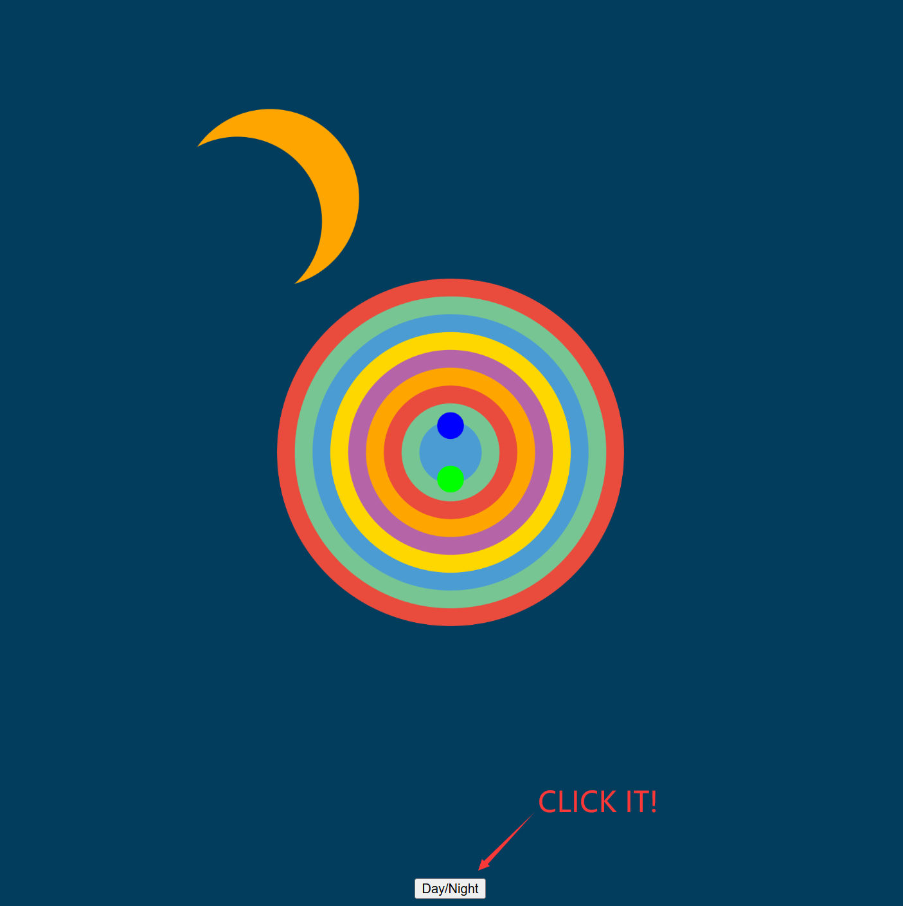

## How to start

Click **Day/Night** below to switch time.

>
>**Figure 1** - The night is quiet while there will be cheerful music during the day.

---

## Introduction of my project
I chose the **AUDIO** theme for adaptation.

In the work, the moon/sun will rotate around the center; all the circles in **"randomCircles"** will appear as the music plays and change size according to the music content.

This work is inspired by our daily life, showing the life scenes of people going out and being active during the day and sleeping quietly at night.

**The following are the specific steps of the adaptation:**
- Import and connect the code with music, and create interactive buttons.
```js
let song, fft, spectrum;
let numBins = 128; // how many frequency bands we have
let smoothing = 0.8;
let button;

// Load music
function preload() {
  song = loadSound("assets/valero.wav");
}

// Control the music to play or not
function play_pause() {
  if(song.isPlaying()) {
    song.stop();
  } else {
    song.loop();
  }
}

function setup() {

  // Connect the code with the music
  fft = new p5.FFT(smoothing, numBins);
  song.connect(fft);

  // Set the button to control the music
  button = createButton("Day/Night");
  button.mousePressed(play_pause);
}
```
- Add a function to analyze the music in the **draw()** function.
```js
spectrum = fft.analyze();
```
- Move the moon shape out of the **originalImage()** function and put it into the **draw()** function. Use the **translate()** and **rotate()** functions to achieve the effect of rotating around the center. At the same time, use the **if** function to make the button control the switching between day and night.
```js
push();
  translate(size / 2, size / 2);

  // Control the rotating animation
  rotationAngle += 0.005; 
  rotate(rotationAngle);

  scale(scaleFactor);
  let moonRadius = 100;
  let offset = 45;
  if(song.isPlaying()) {// DAY
    fill(255, 165, 0);
    ellipse(0, 350, moonRadius * 2);
    fill(3, 61, 94);
    ellipse(0 , 350, moonRadius * 1.9);
    fill(255, 165, 0);
    ellipse(0, 350, moonRadius * 1.8);
  } else {// NIGHT
    fill(255, 165, 0);
    ellipse(0, 350, moonRadius * 2);
    fill(3, 61, 94);
    ellipse(0 + offset, 350, moonRadius * 1.9);
  }

pop();
  ```
- Modify the call loop of **randomCircles** in the **originalImage()** function so that it can change size according to the analyzed **spectrum**.
```js
for (i = 0; i < spectrum.length -50; i++) {//"-50" because there are only 78 circles in total
  let x = map(spectrum[i], 0, 255, 0, 2);//how big the pattern will grow with the music
  fill(randomCircles[i].fill);
  ellipse(randomCircles[i].pattern[0], randomCircles[i].pattern[1], randomCircles[i].pattern[2] * x);
}
```
## Reference
I asked chatGPT how to call a certain value of a certain attribute of a certain item in a certain group. Here is the example:
```js
ellipse(randomCircles[i].pattern[0], randomCircles[i].pattern[1], randomCircles[i].pattern[2] * x);
```
